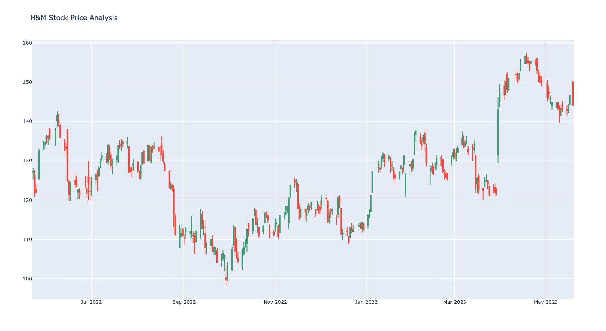

# Stock Market Analysis using Python

## Overview
This project aims to perform stock market analysis using Python, utilizing the yfinance API from Yahoo Finance to collect stock price data for the last year from the current date. It also utilizes the Plotly library to generate various graphs, such as a candlestick chart, bar plot, and time period selectors.

## Prerequisites
Before running this project, make sure you have the following prerequisites installed:

- Python 3.x: Visit the official Python website (https://www.python.org/) to download and install Python.

- Pandas: Install Pandas using the following command:
pip install pandas

- yfinance: Install yfinance using the following command:
pip install yfinance

- Plotly: Install Plotly using the following command:
pip install plotly

## Acknowledgments
- Yahoo Finance for providing the yfinance API.
- Plotly for the interactive data visualization library.
- Pandas for the powerful data manipulation and analysis library.

